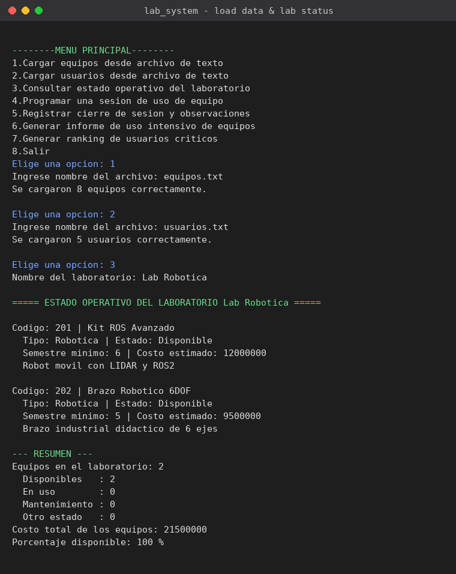
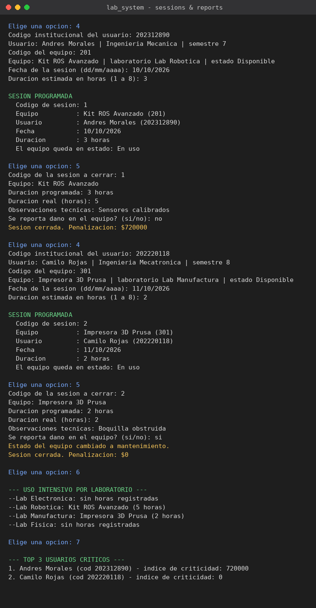

# Lab Equipment Management System

A console application in C++ that manages, schedules and audits the use of equipment across university laboratories (electronics, robotics, manufacturing, physics, etc.).

Built as the structured programming project for **Advanced Programming** at Pontificia Universidad Javeriana.

## Features

| Option | What it does |
|---|---|
| 1 | Load equipment from a text file into dynamic memory |
| 2 | Load users from a text file into dynamic memory |
| 3 | Show the operational status of a laboratory (available, in use, under maintenance, total cost, % available) |
| 4 | Schedule a usage session (validates that the equipment is available and the user meets the minimum semester) |
| 5 | Close a session using **random access** on the binary file: records real hours, technical notes, penalty and damage |
| 6 | Heavy-use report: the equipment with the most accumulated hours in each lab |
| 7 | Top 3 critical users, ranked by `total penalty / number of closed sessions` |
| 8 | Free memory and exit |

**Penalty rule:** 3% of the equipment cost for every hour beyond the scheduled duration.

## Technical constraints (project rules)

- No `std::string`: all text uses `char[]` and C string functions (`strtok`, `strcpy`, `strcmp`).
- Arrays of structs are traversed **only with pointers**, never with `[i]` indexing.
- Explicit dynamic memory with `new[]` / `delete[]`, including pointer-to-pointer parameters.
- Session history is stored in a **binary file** (`sesiones.dat`) with direct access via `seekg` / `seekp`.
- Input validation with retry limits (3 attempts).

## Data structures

```cpp
struct Equipo    { int codigo; char nombre[50]; char laboratorio[40]; char tipo[30];
                   char estadoOperativo[20]; float costoEstimado; int semestreMinimo;
                   char descripcionTecnica[100]; };

struct Usuario   { int codigoInstitucional; char nombre[50];
                   char programaAcademico[50]; int semestre; };

struct SesionUso { int codigoSesion; int codigoEquipo; int codigoUsuario; char fecha[20];
                   int duracionProgramada; int duracionReal; bool cerrada;
                   char observacion[100]; float penalizacion; };
```

## Input file format

Fields are separated by `*`. Extra spaces are trimmed automatically.

`equipos.txt`
```
code * name * lab * type * status * cost * min semester * description
201 * Kit ROS Avanzado * Lab Robotica * Robotica * Disponible * 12000000 * 6 * Robot movil con LIDAR y ROS2
```

`usuarios.txt`
```
institutional code * full name * academic program * semester
202312890 * Andres Morales * Ingenieria Mecanica * 7
```

Valid status values: `Disponible`, `En uso`, `Mantenimiento`.

## Build and run

```bash
g++ -Wall -o lab_system main.cpp
./lab_system
```

Then choose option `1` and type `equipos.txt`, and option `2` and type `usuarios.txt`.

## Repository contents

| File | Description |
|---|---|
| `main.cpp` | Source code |
| `main_commented.cpp` | Same code with line-by-line comments (in Spanish) |
| `equipos.txt` | Sample equipment data |
| `usuarios.txt` | Sample user data |
| `screenshots/` | Program running |

## Screenshots




## Author

Samuel Barrera Pérez
